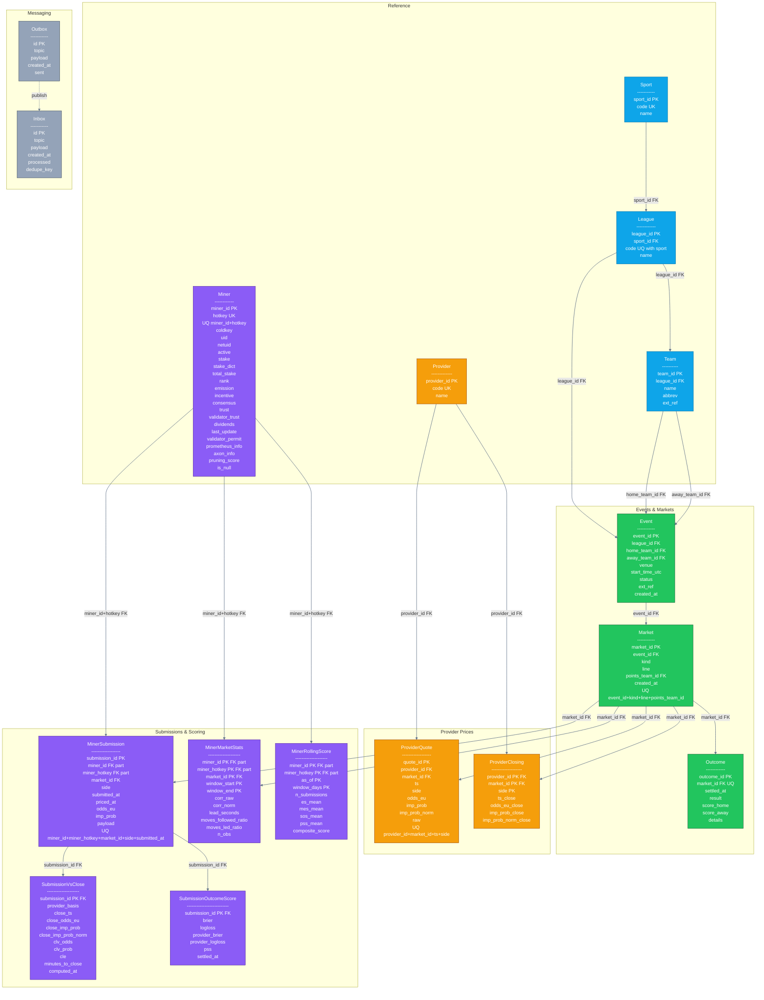

# Validator Schema (ER Diagram)

```mermaid
flowchart TB
    %% Styles
    classDef ref fill:#0ea5e9,stroke:#0369a1,color:#ffffff,stroke-width:1px;
    classDef core fill:#22c55e,stroke:#14532d,color:#ffffff,stroke-width:1px;
    classDef prov fill:#f59e0b,stroke:#92400e,color:#ffffff,stroke-width:1px;
    classDef miner fill:#8b5cf6,stroke:#4c1d95,color:#ffffff,stroke-width:1px;
    classDef msg fill:#94a3b8,stroke:#334155,color:#ffffff,stroke-width:1px;

    %% --- Groups for spacing ---
    subgraph REF[Reference]
      direction TB
      sport[Sport<br/>-----------<br/>sport_id PK<br/>code UK<br/>name]
      league[League<br/>------------<br/>league_id PK<br/>sport_id FK<br/>code UQ with sport<br/>name]
      team[Team<br/>----------<br/>team_id PK<br/>league_id FK<br/>name<br/>abbrev<br/>ext_ref]
      provider[Provider<br/>-------------<br/>provider_id PK<br/>code UK<br/>name]
      miner[Miner<br/>------------<br/>miner_id PK<br/>hotkey UK<br/>UQ miner_id+hotkey<br/>coldkey<br/>uid<br/>netuid<br/>active<br/>stake<br/>stake_dict<br/>total_stake<br/>rank<br/>emission<br/>incentive<br/>consensus<br/>trust<br/>validator_trust<br/>dividends<br/>last_update<br/>validator_permit<br/>prometheus_info<br/>axon_info<br/>pruning_score<br/>is_null]
    end

    subgraph CORE[Events & Markets]
      direction TB
      event[Event<br/>-----------<br/>event_id PK<br/>league_id FK<br/>home_team_id FK<br/>away_team_id FK<br/>venue<br/>start_time_utc<br/>status<br/>ext_ref<br/>created_at]
      market[Market<br/>-----------<br/>market_id PK<br/>event_id FK<br/>kind<br/>line<br/>points_team_id FK<br/>created_at<br/>UQ event_id+kind+line+points_team_id]
      outcome[Outcome<br/>------------<br/>outcome_id PK<br/>market_id FK UQ<br/>settled_at<br/>result<br/>score_home<br/>score_away<br/>details]
    end

    subgraph PROV[Provider Prices]
      direction TB
      provider_quote[ProviderQuote<br/>------------------<br/>quote_id PK<br/>provider_id FK<br/>market_id FK<br/>ts<br/>side<br/>odds_eu<br/>imp_prob<br/>imp_prob_norm<br/>raw<br/>UQ provider_id+market_id+ts+side]
      provider_closing[ProviderClosing<br/>-------------------<br/>provider_id PK FK<br/>market_id PK FK<br/>side PK<br/>ts_close<br/>odds_eu_close<br/>imp_prob_close<br/>imp_prob_norm_close]
    end

    subgraph MINER[Submissions & Scoring]
      direction TB
      miner_submission[MinerSubmission<br/>------------------<br/>submission_id PK<br/>miner_id FK part<br/>miner_hotkey FK part<br/>market_id FK<br/>side<br/>submitted_at<br/>priced_at<br/>odds_eu<br/>imp_prob<br/>payload<br/>UQ miner_id+miner_hotkey+market_id+side+submitted_at]
      submission_vs_close[SubmissionVsClose<br/>--------------------<br/>submission_id PK FK<br/>provider_basis<br/>close_ts<br/>close_odds_eu<br/>close_imp_prob<br/>close_imp_prob_norm<br/>clv_odds<br/>clv_prob<br/>cle<br/>minutes_to_close<br/>computed_at]
      submission_outcome_score[SubmissionOutcomeScore<br/>--------------------------<br/>submission_id PK FK<br/>brier<br/>logloss<br/>provider_brier<br/>provider_logloss<br/>pss<br/>settled_at]
      miner_market_stats[MinerMarketStats<br/>--------------------<br/>miner_id PK FK part<br/>miner_hotkey PK FK part<br/>market_id PK FK<br/>window_start PK<br/>window_end PK<br/>corr_raw<br/>corr_norm<br/>lead_seconds<br/>moves_followed_ratio<br/>moves_led_ratio<br/>n_obs]
      miner_rolling_score[MinerRollingScore<br/>--------------------<br/>miner_id PK FK part<br/>miner_hotkey PK FK part<br/>as_of PK<br/>window_days PK<br/>n_submissions<br/>es_mean<br/>mes_mean<br/>sos_mean<br/>pss_mean<br/>composite_score]
    end

    subgraph MSG[Messaging]
      direction TB
      outbox[Outbox<br/>-----------<br/>id PK<br/>topic<br/>payload<br/>created_at<br/>sent]
      inbox[Inbox<br/>-----------<br/>id PK<br/>topic<br/>payload<br/>created_at<br/>processed<br/>dedupe_key]
    end

    %% Relationships
    sport -->|sport_id FK| league
    league -->|league_id FK| team
    league -->|league_id FK| event
    team -->|home_team_id FK| event
    team -->|away_team_id FK| event

    event -->|event_id FK| market
    market -->|market_id FK| outcome

    provider -->|provider_id FK| provider_quote
    market -->|market_id FK| provider_quote
    provider -->|provider_id FK| provider_closing
    market -->|market_id FK| provider_closing

    miner -->|miner_id+hotkey FK| miner_submission
    market -->|market_id FK| miner_submission
    miner_submission -->|submission_id FK| submission_vs_close
    miner_submission -->|submission_id FK| submission_outcome_score
    miner -->|miner_id+hotkey FK| miner_market_stats
    market -->|market_id FK| miner_market_stats
    miner -->|miner_id+hotkey FK| miner_rolling_score

    outbox -.->|publish| inbox

    %% Class assignments
    class sport,league,team ref
    class provider prov
    class event,market,outcome core
    class provider_quote,provider_closing prov
    class miner,miner_submission,submission_vs_close,submission_outcome_score,miner_market_stats,miner_rolling_score miner
    class outbox,inbox msg

    %% Optional link styling
    linkStyle default stroke:#64748b,stroke-width:1.4px
```
